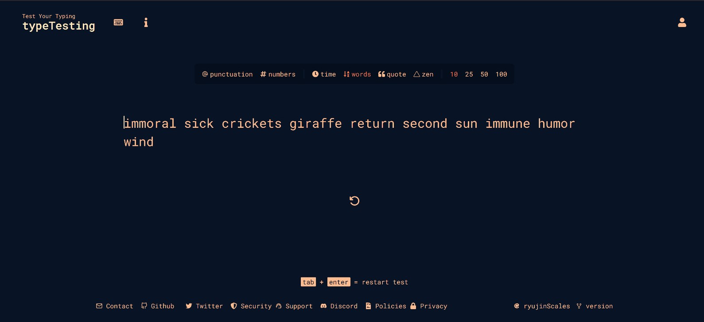

# MonkeyType Clone

> A simplified version of MonkeyType - a typing speed test application.

## Table of Contents

- [About the Project](#About-the-project)
- [Features](#features)
- [Getting Started](#getting-started)
  - [Prerequisites](#prerequisites)
  - [Installation](#installation)
- [Usage](#usage)
- [Technologies Used](#technologies-used)
- [Contributing](#contributing)
- [License](#license)
- [Contact](#contact)

## About the Project

Lite MonkeyType Clone is a web-based application designed to help users improve their typing speed and accuracy. It provides a simplified version of the MonkeyType typing test, allowing users to practice typing quotes, and random words as well as being able to write in zen mode, measuring their typing speed in words per minute (WPM).

## Features

- Practice typing quotes and passages.
- Measure your typing speed in WPM.
- User-friendly and responsive UI.
- Change the theme.
- Track your progress and improvement over time.

## Getting Started

To get a local copy of this project up and running, follow these steps.

### Prerequisites

- [Node.js](https://nodejs.org/) (npm comes with Node.js)
- MongoDB instance (local or cloud-based)

### Installation

1. Clone the repository:
   git clone https://github.com/your-username/lite-monkeytype-clone.git
   cd lite-monkeytype-clone

2. Install server dependencies:
   cd server
   npm install

4. Set up .env and your MongoDB connection URI.

5. Install client dependencies:
   cd ../client
   npm install

## Usage

1. Start the server:
   cd ../server
   npm run dev

2. Start the client:
   cd ../client
   npm run start

## Technologies Used

   MongoDB
   Express.js
   React
   Node.js
   React Router
   Tailwind
   Axios
   Mongoose
   jsonwebtoken
   bcrypt
   nivo
   google-auth
   react
   dotenv
   jwt-decode
   react-query
   react-redux
   react-responsive
   typescript
   ts-node
   validator
   cors

## Contributing

   Contributions are welcome! If you find any bugs or want to enhance the project, feel free to submit a pull request.

## License

   This project is licensed under the MIT License.

## Contact

   For questions or inquiries, please contact:  
   Name - Hamza Ali  
   Email - ellawliet1007@gmail.com  
   Project Link: https://github.com/hamza2001-max/test-typing-mern

